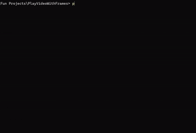

# **Bad Apple, But It’s Randomly Colored Over Time**  

## 📌 Introduction  
Hi! This repository contains Python scripts I used to create a **randomly colored** version of the *Bad Apple* video.  

If you already have experience with Python and FFmpeg, feel free to skip the setup instructions.  

> **Note:** I haven’t tested this on Linux or macOS, so I’ll assume you’re using Windows. However, it should work in any environment with minor adjustments.  

For best results, run these scripts in **VS Code**, as your OS might not execute them directly. VS Code will prompt you to trust the folder—don’t worry, **there’s no virus** here.  

---

## ⚙️ **Setup Instructions**  

### **1 Install Python**  
Make sure you have Python installed. If not, there are plenty of tutorials online to guide you through it.  

### **2 Install Dependencies**  
Open a terminal in the repository folder and run:  
```bash
pip install -r requirements.txt
```

### **3 Extract Audio from Video**  
```bash
ffmpeg -i bad_apple.mp4 -q:a 0 -map a audio.wav
```

### **4 Extract Frames (Takes Time)**  
```bash
python extract.py
```
- This will create an `extract_frames` folder containing individual frames from the video.  

### **5 Colorize Frames (Takes Time)**  
```bash
python change_color.py
```
- This will generate a `colored_frames` folder with randomly colored frames.  

### **6 Enjoy!**  
```bash
python play.py
```
- **Press `Q` to exit!**  

---

## 🐂 **File & Folder Details**  
| File/Folder       | Description |
|-------------------|-------------|
| `play.py`        | Runs the final colored video. |
| `extract.py`     | Extracts frames from *Bad Apple* into `extract_frames`. |
| `change_color.py` | Changes the colors of each frame and saves them in `colored_frames`. |
| `export_video.py` | Exports a video (without sound) from the colored frames. |

---

## 🎥 **How to Make Your Own Colored Videos**  
1. **Want to recolor the frames?**  
   - Delete the `colored_frames` folder and rerun `change_color.py`.  
2. **Accidentally deleted `extract_frames`?**  
   - Just rerun `extract.py`—but make sure to keep the original video (`bad_apple.mp4`) in the folder.  

---

## **Notes**  
I’ll update this repository if I make any improvements or add new features!   

---

## **GIF** 


---
